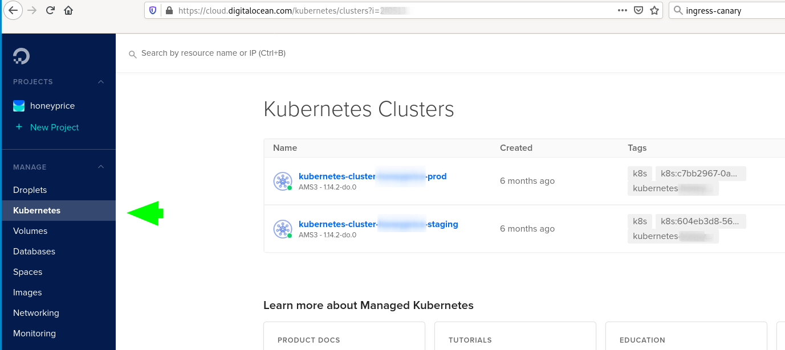

# QR-code


## Who am I

avkoval (bitbucket, github) +<http://alex.koval.kharkov.ua+>

  - Web (Python, Django) developer in +<https://ua2web.com+>
  - DevOps in <https://cupermind.com>
  - Backend Architect

# Why kubernetes

  - Fast scaling (container based, declarative objects configuration)
  - Fault tolerant (e.g. failures on nodes are not critical)
  - Containers are good abstractions:
      - e.g. local [Docker](https://docker.io) provides similar
        environment
  - cluster auto scaling scaling is easy
      - especially on well known providers like AWS, Google, Azure

## Deployment strategies

  - **RollingUpdate** (efs)
  - **Recreate** (All existing Pods are killed before new ones are
    created when)
      - GP2 (RWO)
  - **Canary deployments** strategy (ingress-canary): when we deploy
    several versions of same app
    1.  only part of users will use new app version
    2.  others will see older

## Why (when) not

1.  For a **small** application could be overkill as it requires a lot
    of *overhead*, e.g. several nodes, masters, other services will eat
    a lot of CPU/RAM resources making this unprofitable.

2.  **Complexity** is increased. Running your app on a VM is much
    simpler option. Bugs of Kubernetes, the need to upgrade the cluster
    itself and other things make it overall more difficult to handle.

# Architecture

<https://platform9.com/blog/kubernetes-enterprise-chapter-2-kubernetes-architecture-concepts/>


[Amazon Fargate](https://aws.amazon.com/fargate/)

## infrastructure questions not solved by kubernetes

1.  required from cloud:
    1.  load balancers
    2.  persistent volumes

# Working with cluster - basics

Based on minikube as simplest to try.

## Install [minikube](https://github.com/kubernetes/minikube), kubectl, helm

``` tmux
sudo pacman -S minikube
```

``` tmux
sudo pacman -S kubectl
```

``` tmux
yay kubernetes-helm # aur/kubernetes-helm-bin
```

## Start minikube

``` tmux
minikube start --vm-driver=virtualbox
```

## Point to local minikube docker

1.  environment & helm init
    
    ``` tmux
    eval $(minikube docker-env) 
    ```

## Helm

<https://helm.sh/>

### Helm repo

1.  add repo
    
    ``` tmux
    helm repo add stable https://kubernetes-charts.storage.googleapis.com/
    helm repo add brigade https://brigadecore.github.io/charts
    ```

2.  search
    
    ``` tmux
    helm search repo stable
    ```

3.  install
    
    ``` tmux
    helm install mymysql stable/mysql
    ```

### Installing some ready packages

1.  search & install
    
    ``` tmux
    helm search repo stable
    helm install mymysql stable/mysql
    ```

2.  uninstall
    
    1.  List `helm ls`
        
        ``` tmux
        helm ls
        ```
    
    2.  Uninstall
        
        ``` tmux
        helm uninstall mymysql
        ```

## kubectl common commands

### namespaces

1.  kubectl get namespaces
    
    ``` tmux
    kubectl get namespaces
    ```
    
    Shows all namespaces. Some of them internal to kubernetes. Some of
    them are containers for your applications.

### kubectl pods

1.  get pods
    
    ``` tmux
    kubectl get pods
    ```

2.  delete pod
    
    ``` tmux
    # kubectl delete pod 
    ```

3.  exec -it
    
    ``` tmux
    # kubectl exec -it ...
    ```

### node

1.  get nodes
    
    ``` tmux
    kubectl get nodes
    kubectl describe node minikube
    ```

# Create own app

## Dockerfile

[file:/home/k/dev/kharkivpy-kubernetes/djangoapp/Dockerfile.prod](/home/k/dev/kharkivpy-kubernetes/djangoapp/Dockerfile.prod)

  - [tini](https://github.com/krallin/tini) as init

<!-- end list -->

``` example
FROM python:3.7-stretch
LABEL tier=prod

ENV TERM xterm-256color
ENV PYTHONUNBUFFERED 1

ENV TINI_VERSION v0.18.0
ADD https://github.com/krallin/tini/releases/download/${TINI_VERSION}/tini /tini
RUN chmod +x /tini

...

ENTRYPOINT ["/tini", "--"]
```

## Helm

Helm provides a template, create it for example this way:

``` bash
mkdir helm2 && cd helm2
helm create helloworld
```

Now, lets compare…

# Providers

<https://kubernetes.io/docs/concepts/cluster-administration/cloud-providers/>

## Google

  - Google Kubernetes Engine
    <https://cloud.google.com/kubernetes-engine/>

## Azure

<https://docs.microsoft.com/en-us/azure/aks/>

## Amazon AWS

### EKS

<https://aws.amazon.com/eks/>

### EKS/Fargate

<https://aws.amazon.com/fargate/>

## Digital Ocean



  - Good price (charge only per node, no charges for masters)
  - Works well (\~year), cluster upgrades


# A few words about openshift

<https://cloudowski.com/articles/10-differences-between-openshift-and-kubernetes/>

## Benefits

  - Better UI
  - Authorization / project / user management out of the box
  - Deployments

## Start

  - <https://www.openshift.com/deploying-to-openshift/>
  - <https://www.openshift.com/deploying-to-openshift/>

## Our experience

  - More complex to support from DevOps perspective, less info, most of
    it locked inside of paid subscription for RedHat account

  - As it is less popular the bugs are difficult to fix. Cluster
    upgrades are not that easy.

# Complex topics

## Helm - where to store files/configuration variables/secrets?

  - \[X\] *Helm Charts* are better to be stored with project
  - \[ \] Where to store configuration?
      - We are going to use harshicorp vault for this vaultproject.io
      - \[ \] AWS parameter store?
          - get parameters for version xxx and put it back as yaml to
            helm and helm will apply it
          - *TODO:* check helm-ssm plugin

# Common problems

  - Your app should follow <https://12factor.net/>
  - We had problems with systems like Magento:
      - requires very fast storage for initial deployment phase
      - requires container to be online when building
  - For example problems with persistent disk storage
      - efs is expensive
      - gp2 is cheap but it won't support *RollingUpdate*

# Presentation build with

  - [org-reveal](https://github.com/yjwen/org-reveal/)
  - [Reveal.js](https://revealjs.com/)

# QR-code


## Who am I

avkoval (bitbucket, github) +<http://alex.koval.kharkov.ua+>

  - Web (Python, Django) developer in +<https://ua2web.com+>
  - DevOps in <https://cupermind.com>
  - Backend Architect
